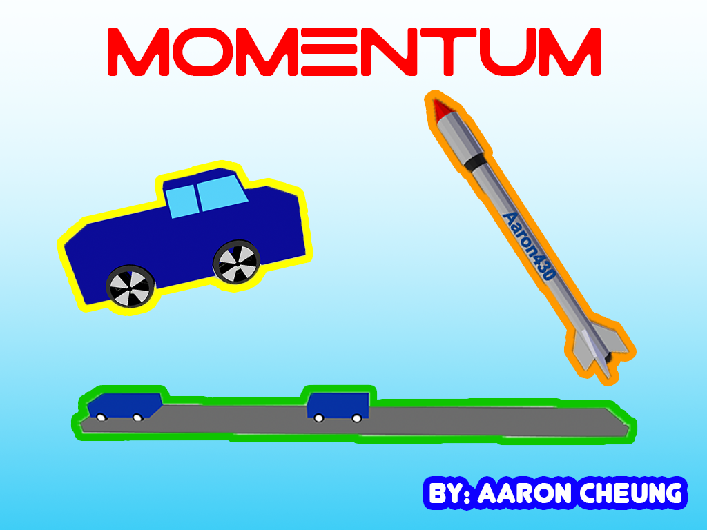
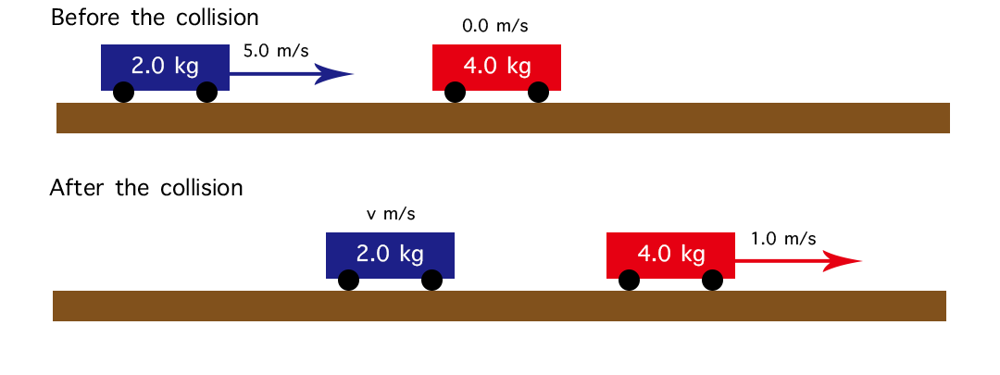

# WWDC2019 - Physics Momentum

**Introduction**

Hi, I would like to share my Scholarship Playground Submission to you! Hope you may leave some suggestion to me so I can improve better next year!😝

You may also visit https://youtu.be/0y0bctNM1yY to watch the video about the project before you downloading it.

**Status**

Accepted

**Description**

The topic of my Playground is ‘Physics - Momentum’. The aim of this Playground is solve some of the problems a teacher may encounter, for example if a school did not have sufficient space to conduct experiments or if there were insufficient funds available to purchase equipment. This Playground would make it possible to carry out the experiment via iPad whilst making the lessons fun and interactive. Please use your iPad (horizontal) to run my Playground Book.

**Images**

